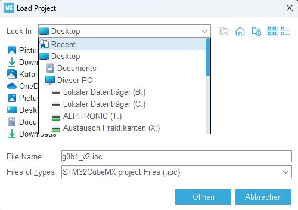
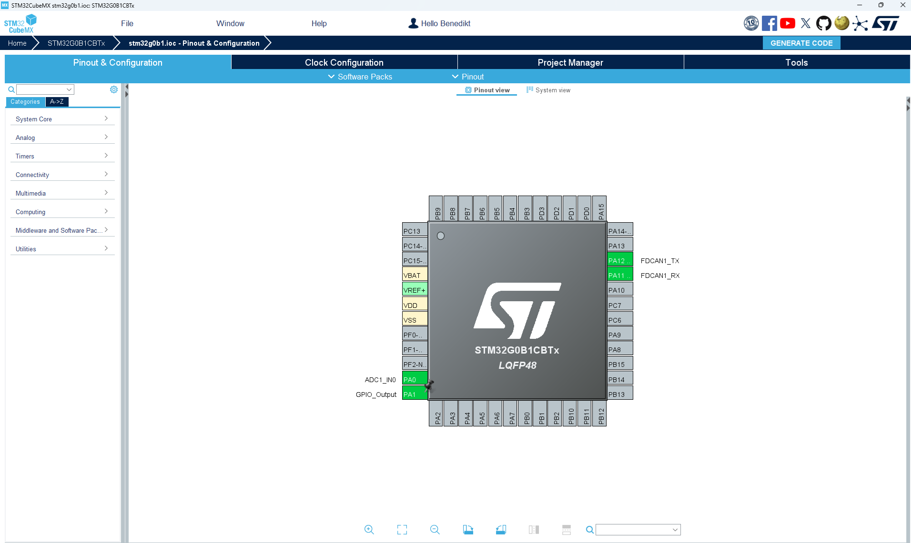
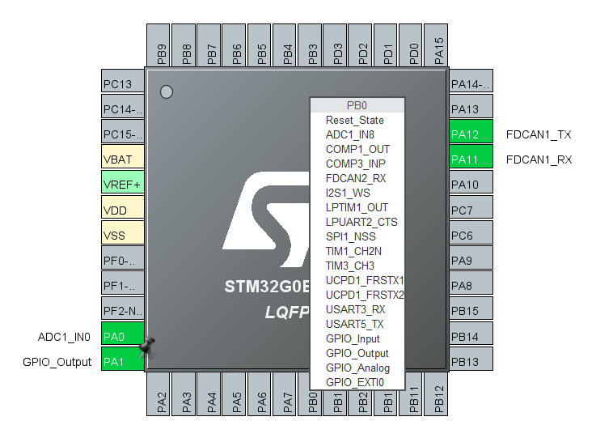
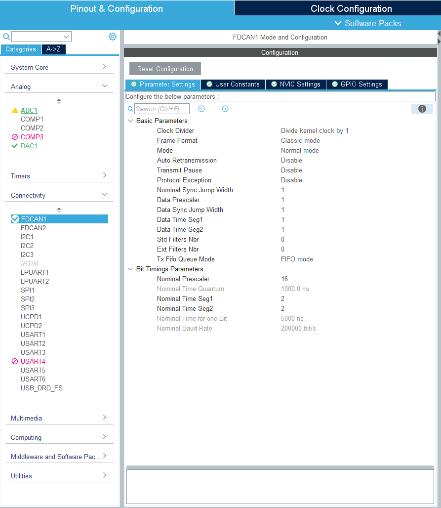

# Regenerate STM32 Initialization Code

This documentation describes the process of regenerating the initialization code for a STM32 Project to add and remove peripherals or change microcontroller settings like the Clock Configuration.

## Open the Project

To regenerate the code STM32CubeMX is used:			[STM32CubeMX - STMicroelectronics](https://www.st.com/en/development-tools/stm32cubemx.html)  
    
If you have STM32CubeMX for Windows and cloned the repository in WSL you have following options:

+ Navigate to the Project folder in the Windows-Explorer and open the STM32CubeMX-Project file (works for Folder Windows and WSL).

+ Copy the folder contents into a Windows-Folder, make the changes to the initialization code which will be described below and then copy the folder back onto WSL.
    + To open the Project search for the cloned project Folder and open the *.ioc*-file.

+ Search for WSL in the STM32CubeMX-Explorer when opening the project. This can be quite tricky because WSL is not directly shown in the explorer. 
    + When loading a project select *Recent* from the *"Look In"*-Dropdown-Menu:

        

    + Then search for a Folder which you know is located in WSL and from there navigate to the cloned repository

    + Open the  *.ioc*-file

## Customize peripherals

After opening the project in STm32CubeMX you should see following screen. 

To add a peripheral click onto a pin of the Microcontroller-Image and then choose its function from the menu that will show up: 

You can remove a peripheral the same way.  
On the left there are dropdown-menu's and search for the different peripherals.  
When clicking on an activated peripheral a menu will be opened where you can change the settings of the peripheral:  

## Generate new Initialization Code

Check again that all the self written Code is between the given commented sections like this or it will be overwritten:

    /* USER CODE BEGIN SysInit */

    // Custom Code

    /* USER CODE END SysInit */

To generate the new Initialization Code click on the Blue *Generate Code* Button on the upper right side.
